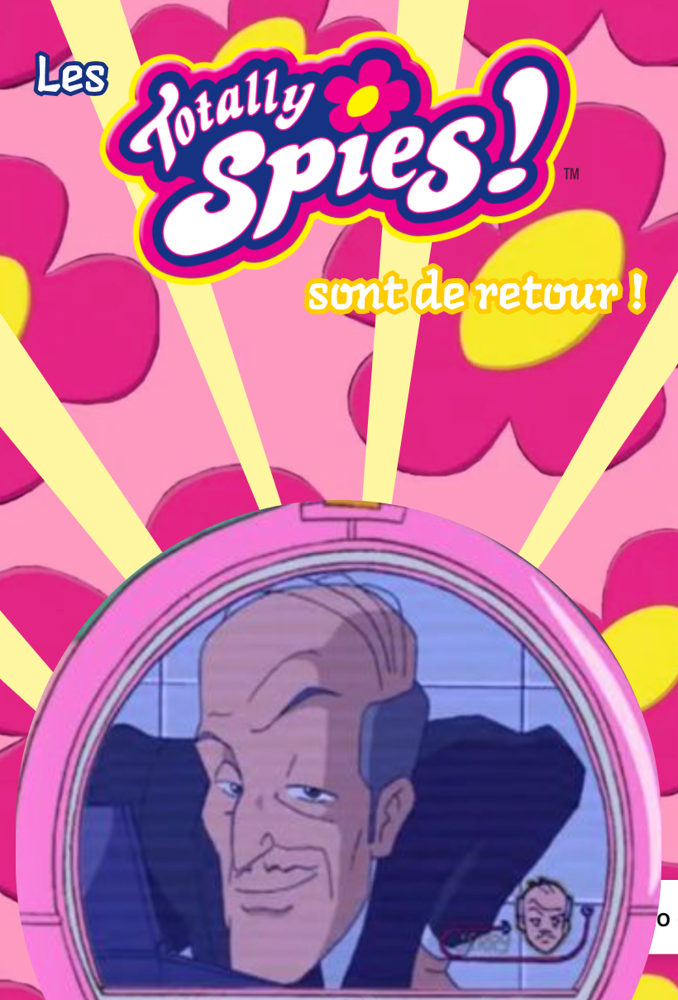

# Creative-dev

Ce projet a été réalisé par Aurore Dimech et Brunic Feyou.

## Description 

Ce projet est un site internet présentant une affiche animée pour la nouvelle saison des Totally Spies!. Elle reprend donc les éléments liés à cet univers de manière attrayante.

## Installation et lancement du projet
- Cloner le projet.
- L'ouvrir dans un éditeur de code.
- Lancer un serveur en ligne (tel que Go Live)
- Aller sur l'url donnée
- Profiter de l'expérience

## Moodboard

Voici le moodboard du projet, et sur lequel nous nous sommes basés afin de réaliser notre affiche

## Explication du concept et de l'oeuvre.

Le dessin animé les Totally Spies! est une série emblématique pour beaucoup d'enfants. Loin d'être juste un divertissement, les aventures vécues par Sam, Alex et Clover ont su inspirer des générations entières, et surtout des jeunes filles, à se surpasser, à avoir confiance en soi, et à se battre en ce on croit. 
C'est pourquoi nous avons été spécialement inspirés à travailler sur cette source.

Afin de rester dans l'univers de notre source, nous avons décidé de garder des couleurs vives et saturées. En plus de rappeler notre source, le code couleur choisi (dans les teintes roses et jaunes notamment) a pour objectif d'inspirer de la joie chez les spectateurs et spectatrices et de faire référence à d'autres oeuvres similaires aux Totally Spies! - telles que les Super Nanas par exemple.
Pareillement, nous nous sommes plutôt dirigés sur un style "flat", d'applats de couleurs, afin de rester fidèle à l'esthétique de la série animée des Totally Spies !.

De surcroît, il nous a semblé primordial de reprendre le symbole de la fleur, représentatif de cette série, agissant comme le logo du dessin animé. 

## Maquette

Nous avons réalisé cette page web à partir d'une maquette réalisée par nos soins, visible ci-dessous

